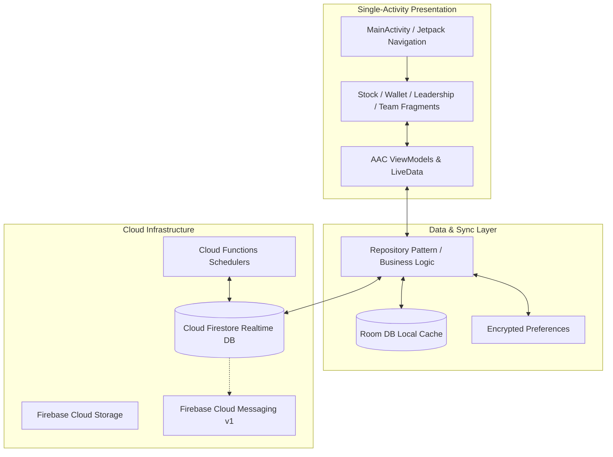
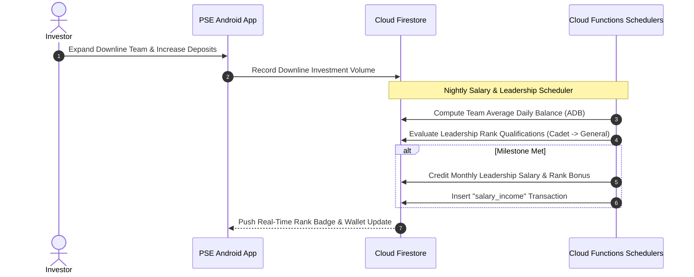

# Philippine Stock Exchange (PSE User Client)

[](https://developer.android.com)
[](https://kotlinlang.org/)
[](https://developer.android.com)
[](https://developer.android.com/topic/architecture)
[](https://firebase.google.com/docs/firestore)
[](LICENSE)

> Next-generation Android investment client for the Philippine Stock Exchange ecosystem, featuring stock asset portfolios, leadership career tiering (Cadet to General), automated monthly salary programs, multi-level affiliate tracking, and USDT crypto deposits.

---

## 📖 Overview

**Philippine Stock Exchange (PSE) User App** is a premier retail trading and fintech application engineered with **Kotlin**, **Android SDK 36**, and **Clean MVVM Architecture**. It integrates deeply with **Firebase Firestore**, **Cloud Functions**, and **CoinPayments** crypto rails to provide users with transparent stock package investments, real-time ROI accruals, multi-tier affiliate rewards, and automated monthly leadership stipends.

### Key Value Propositions
- **Curated Equity Portfolios**: Access high-yield stock investment contracts with fixed daily percentage returns and principal return upon maturity.
- **Leadership Career & Rank Progression**: Ascend through structured career ranks (from *Astro Cadet* to *Solar General*) to unlock recurring monthly leadership salaries.
- **Hierarchical MLM Affiliate Engine**: Interactive multi-level team explorer tracking downline deposits, active recruits, and real-time commission payouts.
- **Instant Crypto Settlements**: Seamless USDT-BEP20 deposit invoice generation with QR code rendering and automated withdrawal request validation.
- **Integrated Live Support Desk**: 1-on-1 real-time messaging with platform administrators powered by Firestore snapshot streams and FCM v1.

---

## 🏗️ Architecture & Core Flow



### Leadership Rank & Salary Settlement Sequence



---

## ✨ Core Features

### 1. 📊 Stock Investment Packages
- **Dynamic Plan Marketplace**: Explore equity-backed investment packages featuring clear daily yield percentages, lockup timelines, and capital release terms.
- **Active Holdings Portfolio**: Real-time portfolio tracking showing accumulated daily profits, remaining contract days, and total ROI.

### 2. 🎖️ Leadership Career Progression & Salaries
- **Tiered Leadership Ranks**: Ascend through ranks including Cadet, Lieutenant, Captain, Commander, and Solar General based on direct recruits and team volume.
- **Automated Monthly Salary (ADB)**: Continuous computation of downline Average Daily Balance to disburse recurring monthly executive salaries.

### 3. 👥 Multi-Level Team & Affiliate Network
- **Interactive Team Viewer**: Multi-tier breakdown showing active and inactive downline investors, total volume, and tier turnover.
- **Leaderboard Rankings**: Global investor rankings showcasing top-performing network builders.

### 4. 💳 Wallet & Transaction Management
- **USDT-BEP20 Deposits**: Instant deposit address and QR code rendering for fast cryptocurrency top-ups.
- **Secure Withdrawals**: Automated withdrawal submission with balance locking and administrative approval tracking.
- **Filterable Financial Ledger**: Categorized records for ROI profits, salary income, referral bonuses, deposits, and payouts.

### 5. 💬 In-App Support Chat & OTA Updates
- **Real-Time 1-on-1 Chat**: Fast, bidirectional customer support messaging with admin agents.
- **OTA Silent App Updater**: Background version check, APK download, and integrity verification (`RemoteUpdateManager`).

---

## 📱 Key Screens & Navigation Map

| Module | Fragment / Activity | Description |
|---|---|---|
| **Authentication** | `SignInFragment`, `SignUpFragment`, `SplashFragment` | User onboarding, secure token authentication, session handling. |
| **Home Dashboard** | `HomeFragment` | Net worth balance, daily profit summary, quick actions, promotional slider. |
| **Stock Plans** | `PlanFragment`, `BuyPlanFragment`, `MyPlansFragment` | Browse stock catalogs, purchase contracts, and view active portfolios. |
| **Leadership & Career**| `LeadershipFragment`, `SalaryIncomeFragment` | Leadership tier milestones, rank badges, and monthly salary statements. |
| **Team & Network** | `TeamLevelsFragment`, `LevelUsersFragment`, `TeamRankingFragment` | Multi-tier team hierarchy, downline directory, ranking boards. |
| **Wallet & Ledger** | `DepositAmountFragment`, `WithdrawAmountFragment`, `TransactionHistoryFragment` | Crypto wallet deposits, withdrawal forms, and ledger transactions. |
| **Customer Support** | `SupportFragment`, `ChatFragment`, `DetailChatFragment` | Support ticket filing and live chat console with admins. |

---

## 🛠️ Technical Stack Matrix

| Layer | Technologies / Libraries |
|---|---|
| **Language & Tooling** | Kotlin 2.0.21, JDK 17/21, Gradle Version Catalogs, Android SDK 36 |
| **UI Framework** | Jetpack ViewBinding, Jetpack Navigation 2.8.5, ConstraintLayout, Material 3 |
| **Architecture** | MVVM (Model-View-ViewModel), Repository Pattern, Clean Architecture |
| **Local Persistence** | Android Jetpack Room DB (KSP compiler), Encrypted SharedPreferences |
| **Backend & Cloud** | Google Firebase (Firestore NoSQL, Cloud Functions v2, Cloud Storage, FCM v1) |
| **Media & Animation** | Glide 4.16, Lottie 6.5.2, CircleImageView, Ultra Pull-To-Refresh |
| **Networking & Crypto**| OkHttp3, Volley, Gson, CoinPayments Java SDK, gRPC Protobuf-Lite |

---

## 🚀 Getting Started

### Prerequisites
- **Android Studio Ladybug (2024.2.1+)** or higher.
- **JDK 17** configured as Gradle JVM.
- **Android SDK 36** installed.
- Active Firebase Project with Firestore and Cloud Messaging configured.

### Installation & Setup

1. **Clone the Repository**:
   ```bash
   git clone https://github.com/shayann07/Philippine-Stock-Exchange-user.git
   cd Philippine-Stock-Exchange-user
   ```

2. **Configure SDK Location**:
   ```bash
   cp local.properties.example local.properties
   ```
   Add your Android SDK path to `local.properties`.

3. **Firebase Setup**:
   Download `google-services.json` from the Firebase Console and place it into `app/`:
   ```text
   app/google-services.json
   ```

4. **Build & Execute**:
   ```bash
   # Assemble Debug APK
   ./gradlew assembleDebug

   # Run Unit Tests
   ./gradlew testDebugUnitTest
   ```

---

## 📄 License

This project is open-source software licensed under the [MIT License](LICENSE) — Copyright (c) 2026 [shayann07](https://github.com/shayann07).
