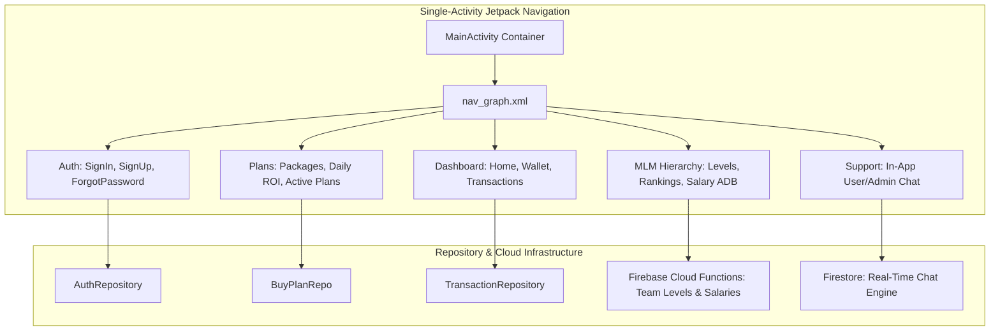

# Philippine Stock Exchange (PSE) — Android Trading & Investment Client

[](https://kotlinlang.org)
[](https://developer.android.com)
[](https://gradle.org)
[](https://firebase.google.com)
[](LICENSE)

PSE is a feature-rich native Android trading, investment portfolio, and multi-tier team management client application built with modern Kotlin, Jetpack Navigation, and Firebase serverless cloud architecture.

---

## Application Architecture



---

## Key Features

- **Single-Activity Architecture**: 26 specialized UI fragments organized cleanly with Android Jetpack Navigation and ViewBinding.
- **Crypto Deposit & QR Generator**: Seamless CoinPayments integration with dynamic ZXing QR code rendering for USDT-BEP20.
- **Multi-Tier Team Commission System**: Automated calculation of multi-level referral bonuses, team rankings (Astro Cadet through Solar General), and salary average daily balance (ADB).
- **In-App Real-Time Customer Support**: Direct user-to-admin instant messaging built on Cloud Firestore real-time snapshots.
- **OTA Self-Update Subsystem**: Remote APK version checking via Firebase Remote Config and background download/hash verification.

---

## Technical Stack

| Component | Library / Framework | Version |
|---|---|---|
| **Language** | Kotlin | 2.0.21 |
| **Build System** | Android Gradle Plugin / Gradle | 8.12.0 / 8.14.3 |
| **SDK Levels** | Compile SDK: 36, Target SDK: 36, Min SDK: 24 | Android 7.0+ |
| **Navigation & UI** | Jetpack Navigation Component + ViewBinding | 2.9.0 |
| **Cloud Services** | Firebase Auth, Firestore, Cloud Functions, FCM, Remote Config | Firebase BoM 32.3.0 |
| **Networking & HTTP** | OkHttp3 + Gson | 4.12.0 / 2.12.1 |
| **Imaging & QR** | Glide / Picasso / ZXing | 4.16.0 / 3.5.0 |

---

## Setup & Local Development

### Prerequisites
- Android Studio Ladybug (2024.2.1+) or newer
- JDK 17 / Java 11 runtime
- Android SDK 36 installed

### Step-by-Step Configuration

1. **Clone the Repository:**
   ```bash
   git clone https://github.com/shayann07/Philippine-Stock-Exchange-user.git
   cd Philippine-Stock-Exchange-user
   ```

2. **Configure Firebase Credentials:**
   Copy the example template and supply your Firebase project config:
   ```bash
   cp app/google-services.json.example app/google-services.json
   ```

3. **Configure Local SDK:**
   ```bash
   cp local.properties.example local.properties
   ```

4. **Build the Application:**
   ```bash
   ./gradlew assembleDebug
   ```

---

## Repository Structure

```
Philippine-Stock-Exchange-user/
├── app/
│   ├── src/main/
│   │   ├── java/com/pse/pse/
│   │   │   ├── adapters/       # Recycler & ViewPager adapters
│   │   │   ├── data/           # Auth, Account, Transaction, BuyPlan repositories
│   │   │   ├── fcm/            # Push notification & FCM token services
│   │   │   ├── models/         # Data entities (Plan, Transaction, UserModel, etc.)
│   │   │   ├── ui/             # MainActivity, 26 Fragments, 7 ViewModels
│   │   │   └── utils/          # Constants, RemoteUpdateManager, SharedPrefs
│   │   ├── res/                # ~90 layouts, navigation graph, themes
│   │   └── AndroidManifest.xml # Kiosk permissions & components
│   ├── google-services.json.example
│   └── build.gradle.kts
├── local.properties.example
├── LICENSE                     # MIT License
└── README.md
```

---

## License

Distributed under the MIT License. See [LICENSE](LICENSE) for more information.

Copyright (c) 2026 **shayann07**
